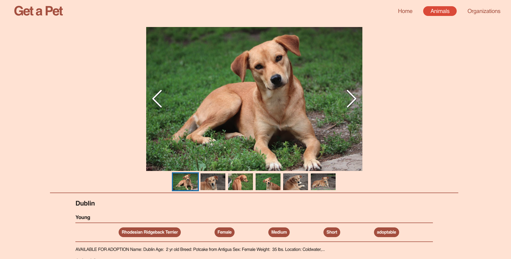
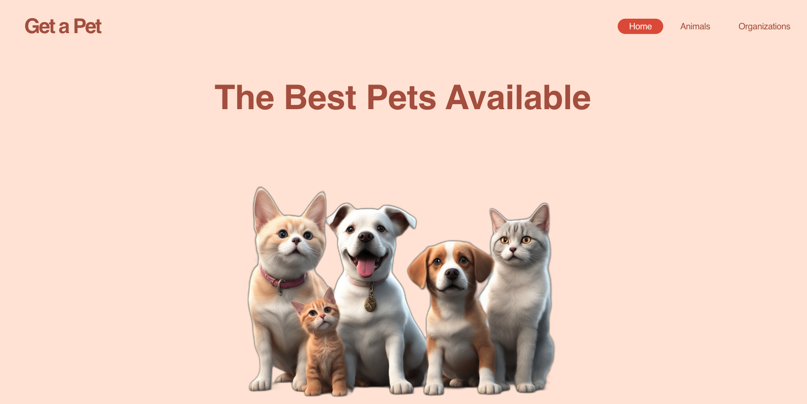
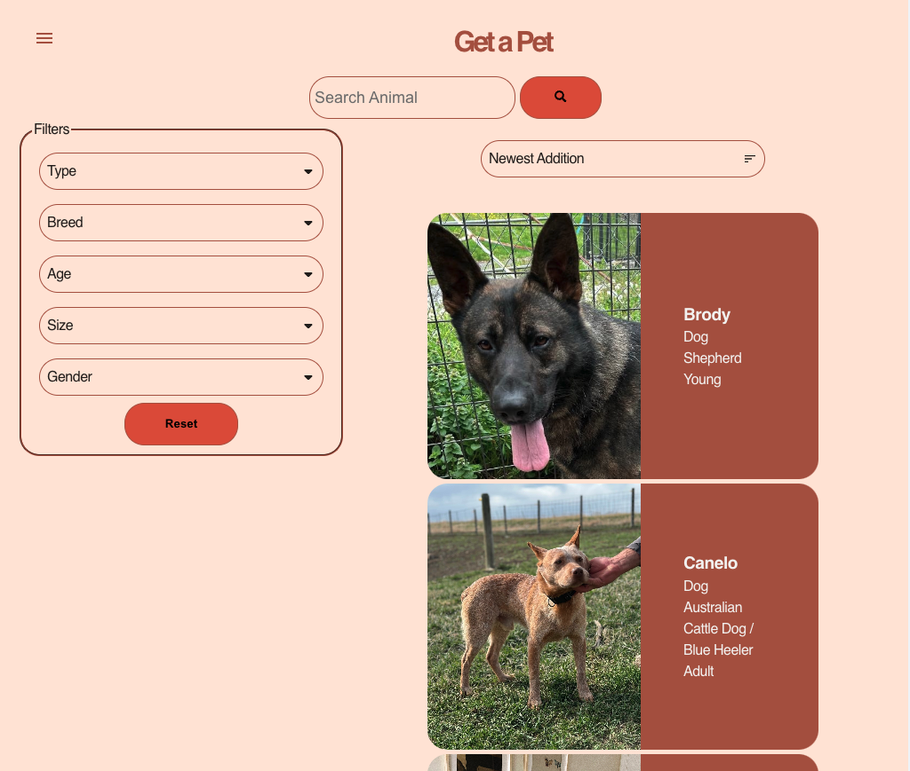
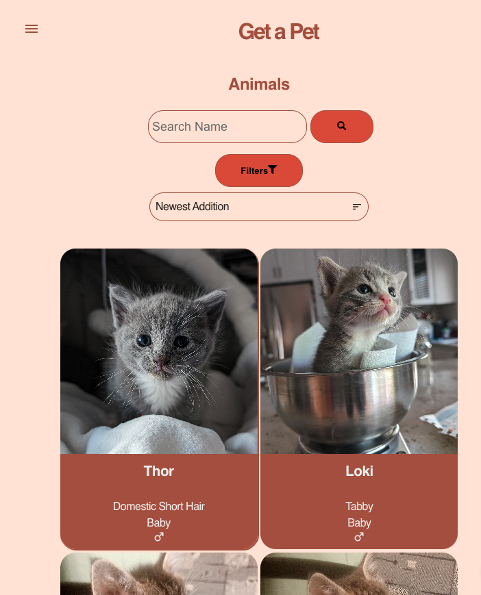
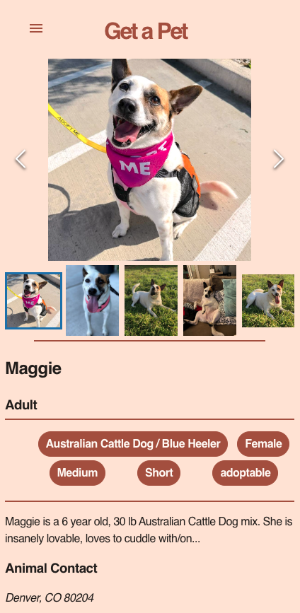
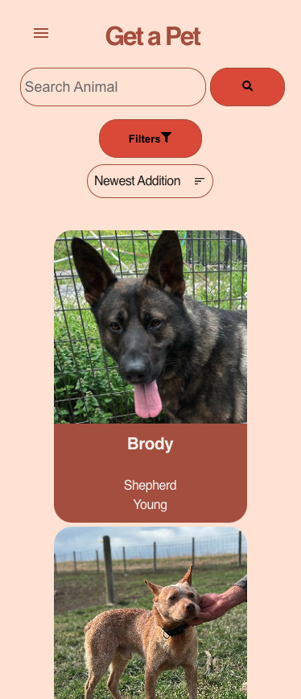
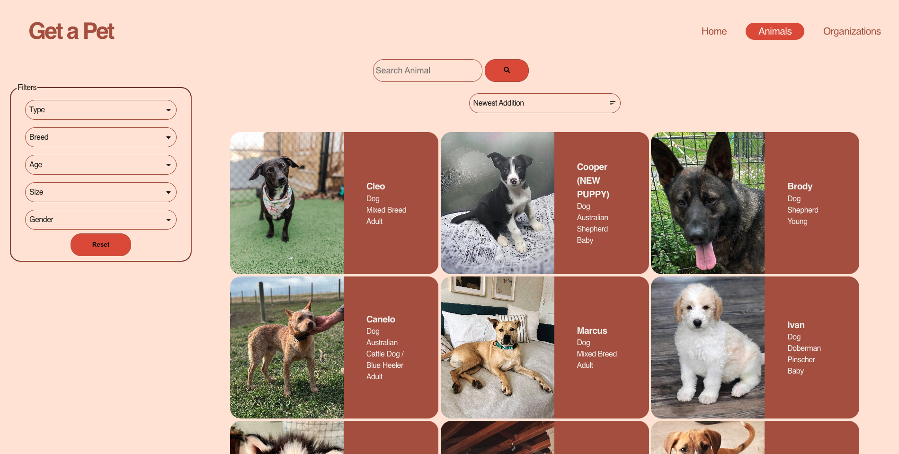

# Get a Pet

A website portfolio to showcase using React frontend technologies. The website uses a free REST API from https://petfinder.com to create a Pet Adoption Listing and show the animals that are available for adoption in the USA. 

The website demonstrates the usage of React Query for server state management, Context API for client state management, React Router for routing, Vitest/React Testing Library/MSW for Unit Testing.
## Installation

Register and request free API keys from https://www.petfinder.com/developers/.

Download the project locally and run the following
Create a .env file in the same level as the main index.html. Place the API keys from petfinder into the .env file.

```bash
VITE_CLIENT_ID="<YOUR_CLIENT_ID>"
VITE_CLIENT_SECRET="<YOUR_CLIENT_SECRET>"
```
Open a terminal navigate to the project folder. Run the following commands:
```bash
  npm install
  npm run dev
```

Open the URL to the local server provided by vite.
## Running Tests

To run tests, run the following command

```bash
  npm run test
```


## Tech Stack

**Client:** Typescript, React, React Context API, React Query, React Router, CSS Modules, React Image Gallery, React Icons, dotenv

**Test:** Vitest, React Testing Library, MSW


## Usage/Examples







